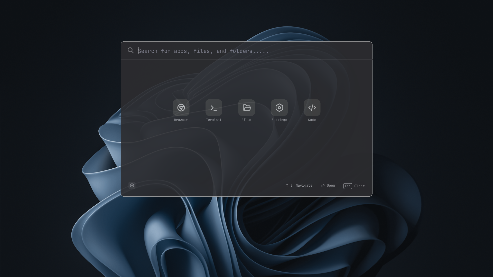
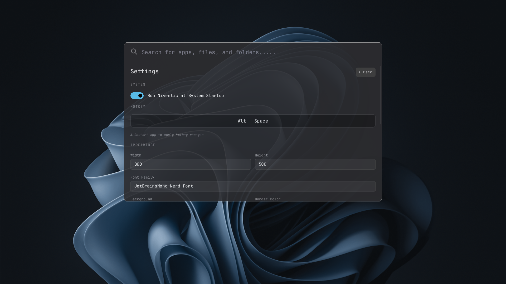
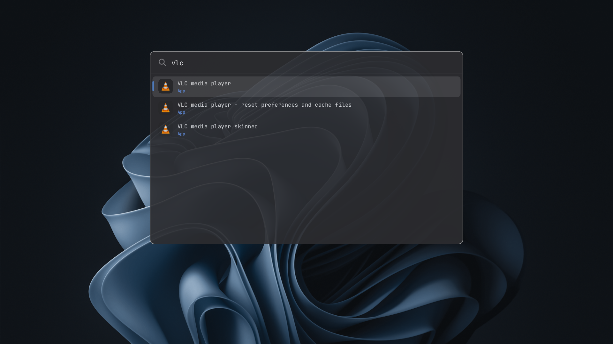

# Niventic Launcher

<p align="center">
  
  
</p>
<p align="center">
  
</p>

Niventic is a fast, lightweight, and customizable command palette and application launcher for Windows, built with [Rust](https://www.rust-lang.org/) and the [Slint UI framework](https://slint.dev/).

It provides a quick way to launch apps, search files, and access your favorite tools via customizable hotkeys (default: `Alt + Space`).

## Features
- **Fast**: Native Windows performance powered by Rust.
- **Customizable Appearance**: Change colors, opacity, border radius, and fonts directly from the UI.
- **Global Hotkey**: Instantly summon the launcher from anywhere.
- **Quick Access Grid**: Pin your most-used tools with custom icons.
- **Auto-start**: Option to run automatically when Windows starts.
- **Portable Configuration**: All settings are saved locally as a simple TOML file.

## Installation & Setup

Niventic is currently distributed as a standalone portable executable (`.exe`). **There is no installer needed.**

### Option 1: Download Pre-built Release (Recommended)
1. Go to the **Releases** page on GitHub and download the latest `niventic.exe`.
2. **Move the `.exe` to a permanent secure location** (for example: `C:\Niventic\` or `C:\Program Files\Niventic\`). *Do not leave it in your Downloads folder, as accidentally deleting the file will break the app and auto-start features.*
3. Double-click `niventic.exe` to start the app.
4. The launcher will run silently in the background (look for its icon in your system tray).
5. Press `Alt + Space` anywhere to open the launcher.

## Configuration & Data

All your settings, custom hotkeys, and downloaded icons are stored safely in your user AppData folder. You can back up or modify these files directly:

- **Config File:** `%APPDATA%\niventic\config.toml`
- **Custom Icons:** `%APPDATA%\niventic\icons\`

*Tip: If you ever want to reset Niventic to its default settings, simply delete the `config.toml` file and restart the application.*

### Option 2: Build from Source

Ensure you have [Rust](https://rustup.rs/) installed, then run:

```bash
git clone https://github.com/dzikrihilman/niventic-search.git
cd niventic-search
cargo build --release
```

The optimized executable will be located in `target/release/niventic.exe`.

## License
[MIT License](LICENSE)
